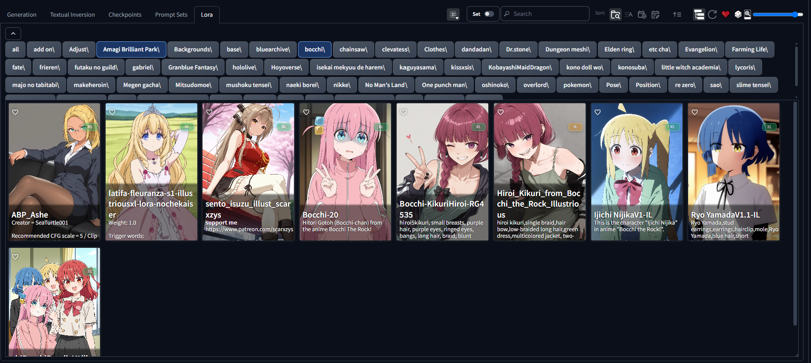
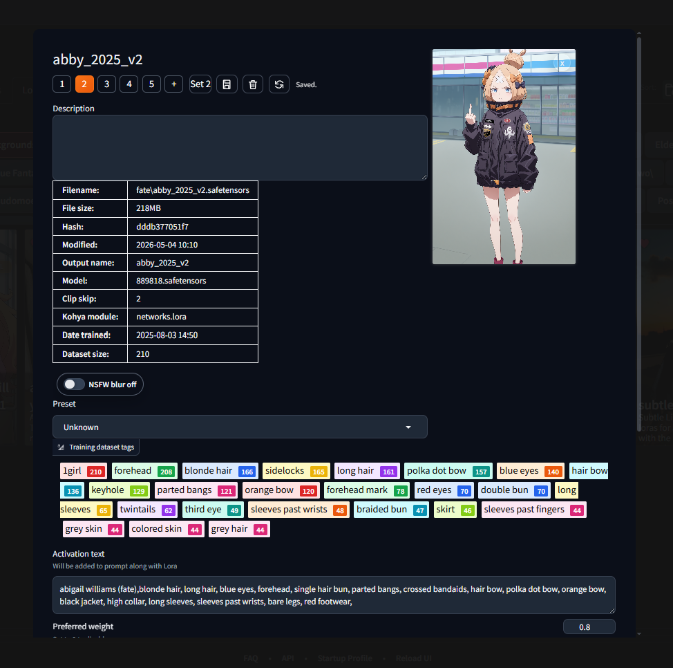

# Forge Better Cards

Forge Better Cards adds a small set of tools to Forge/A1111 Extra Networks
cards: per-card sets, local image support, folder filters, and a lightweight
editor.

## Screenshots

### Browse and filter

Use this area to browse cards, search by name, and narrow the list with folder
buttons.

- The folder strip can be collapsed or expanded.
- Folder buttons can be included or excluded.
- The `Set` toggle shows or hides the extra set controls.
- The card area keeps the normal Extra Networks layout, with Better Cards
  controls added on top.

### Card editor

Open this from the `BC` button on a card.

- Edit the active set fields.
- Add another set with the `+` button.
- Rename, save, delete, or reset the current card data.
- A card with no saved data starts with one default set.

### Add or replace preview image

Click the preview area to pick an image, or drop one in.

- Use this to replace the current preview image.
- The same editor also supports dragging in an image file.
- Uploaded images are stored locally by the extension.

### Preview lightbox

Click a preview image to open it larger.

- Step through multiple images on the same set.
- Zoom in, zoom out, or reset the view.
- Add or remove images from inside the lightbox.
- Drag to pan when zoomed in.

## Features

- Adds a `BC` button to Extra Networks cards.
- Stores multiple sets per card.
- Each set can hold:
  - label
  - activation text
  - negative prompt
  - notes
  - weight
  - one or more images
- Lets you open preview images in a lightbox.
- Lets you add or replace preview images from the editor.
- Supports drag-and-drop and upload for set images.
- Saves folder include/exclude filters per tab and can collapse or reopen the
  folder strip.
- Records usage metadata for Last Used / Most Used style sorting.
- Can seed initial sets from Card Master metadata when available.

## How To Use

1. Open an Extra Networks tab.
2. Click `BC` on a card to open the editor.
3. Edit the set fields or add another set.
4. Use the arrows on the card to switch sets.
5. Click a card to apply the active set to the prompt.

## Installation

Clone this extension into the Forge `extensions/` folder, then restart the web
UI.

## Data

All saved card data is stored locally in:

`data/better_cards.json`

Uploaded images are stored in:

`data/images/`

## Compatibility

- Works with Forge and A1111 Extra Networks cards.
- Uses Card Master metadata when present, but does not require it.
- Designed to live alongside other Extra Networks extensions.

## Notes

- Card identity is tracked by page, path, and name.
- Cards without saved Better Cards data start with one default set.
- Image URLs are limited to direct image links or the extension image endpoint.
