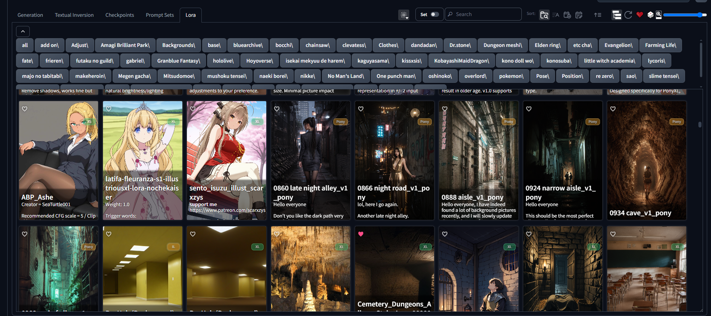

# Forge Better Cards

Forge Better Cards adds extra controls to Forge/A1111 Extra Networks cards, with
per-card sets, local image support, and a small editor that stays out of the
way until you need it.

## Screenshots

## What it does

- Adds a `BC` button on Extra Networks cards.
- Lets each card store multiple sets.
- Each set can have:
  - label
  - activation text
  - negative prompt
  - notes
  - weight
  - one or more images
- Opens preview images from the metadata popup in a larger lightbox.
- Supports drag-and-drop or upload for set images.
- Lets each card use its own weight range and default value.
- Can seed initial sets from Card Master metadata when available.
- Supports sorting cards by usage: last used or most used.

## How to use

1. Open an Extra Networks tab.
2. Click `BC` on a card to open the Better Cards editor.
3. Add or edit sets.
4. Use the card navigation arrows to switch sets on the card itself.
5. Click a card to apply the active set to the prompt.

## Installation

Clone this extension into the Forge `extensions/` folder, then restart the web
UI.

## Data storage

All card data is stored locally in:

`data/better_cards.json`

Uploaded images are stored in:

`data/images/`

## Compatibility

- Works with Forge and A1111 Extra Networks cards.
- Uses Card Master metadata when present, but does not require it.
- Designed to live alongside other Extra Networks extensions.

## Notes

- The extension keeps card identity by page, path, and name.
- If a card has no saved Better Cards data yet, it starts with one default set.
- Image URLs are limited to direct image links or the extension image endpoint.
