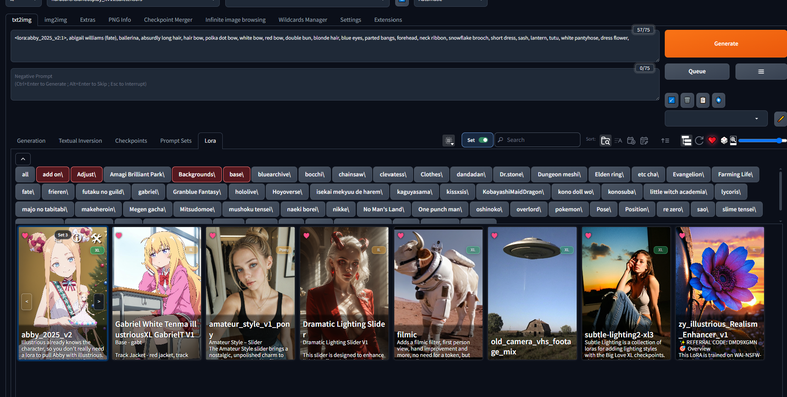
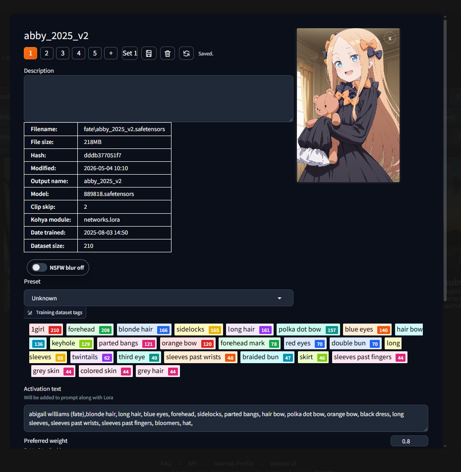
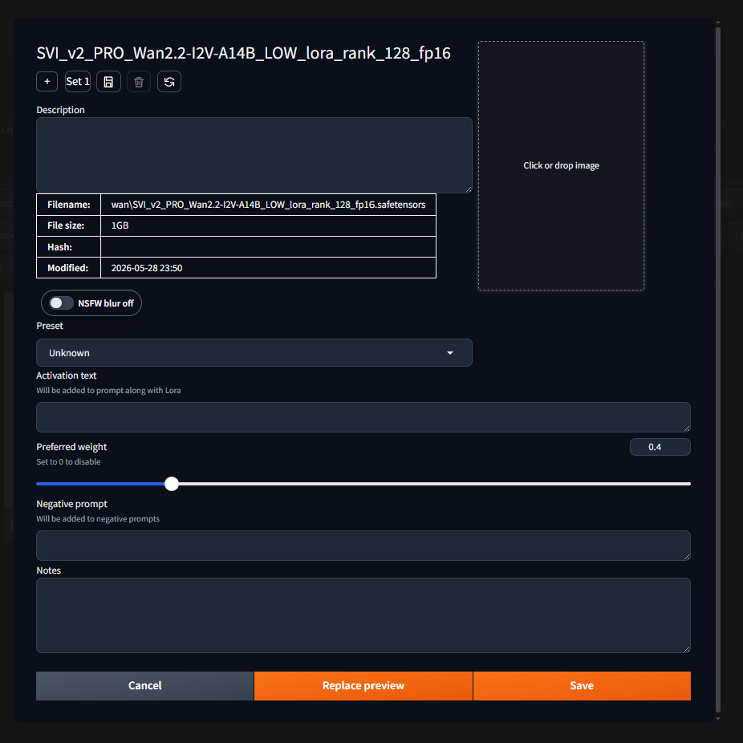
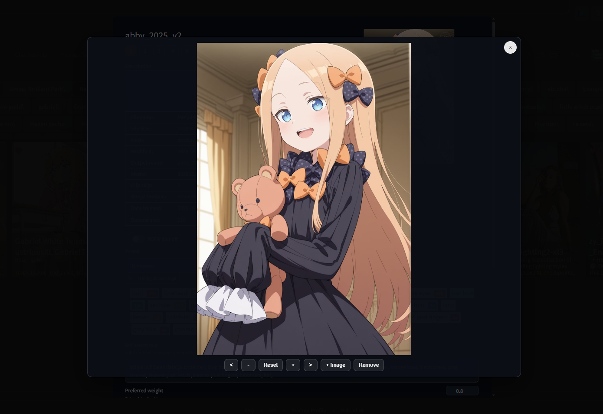

# Forge Better Cards

Forge Better Cards adds a small set of tools to Forge/A1111 Extra Networks
cards: per-card sets, local image support, folder filters, and a lightweight
editor.

## Screenshots

### Browse and filter

### Card editor

### Add or replace preview image

### Preview lightbox

## Features

- Adds a `BC` button to Extra Networks cards.
- Stores multiple sets per card.
- Each set can hold:
  - label
  - activation text
  - negative prompt
  - notes
  - weight
  - one or more images
- Lets you open preview images in a lightbox.
- Lets you add or replace preview images from the editor.
- Supports drag-and-drop and upload for set images.
- Saves folder include/exclude filters per tab and can collapse or reopen the
  folder strip.
- Records usage metadata for Last Used / Most Used style sorting.
- Can seed initial sets from Card Master metadata when available.

## How To Use

1. Open an Extra Networks tab.
2. Click `BC` on a card to open the editor.
3. Edit the set fields or add another set.
4. Use the arrows on the card to switch sets.
5. Click a card to apply the active set to the prompt.

## Installation

Clone this extension into the Forge `extensions/` folder, then restart the web
UI.

## Data

All saved card data is stored locally in:

`data/better_cards.json`

Uploaded images are stored in:

`data/images/`

## Compatibility

- Works with Forge and A1111 Extra Networks cards.
- Uses Card Master metadata when present, but does not require it.
- Designed to live alongside other Extra Networks extensions.

## Notes

- Card identity is tracked by page, path, and name.
- Cards without saved Better Cards data start with one default set.
- Image URLs are limited to direct image links or the extension image endpoint.
